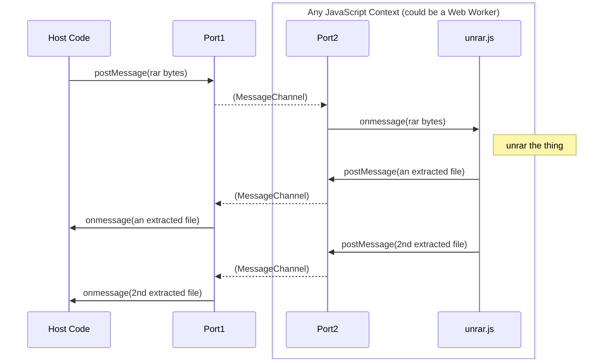

# bitjs.archive

This package includes objects for unarchiving binary data in popular archive formats (zip, rar,
tar, gzip) providing unzip, unrar, untar, gunzip capabilities via JavaScript in the browser or
various JavaScript runtimes (node, deno, bun).

A compressor that creates Zip files is also present.

The decompression / compression happens inside a Web Worker, if the runtime supports it (browsers,
deno). The library uses native decompression, if supported by the browser
(via [DecompressionStream](https://developer.mozilla.org/en-US/docs/Web/API/DecompressionStream/DecompressionStream)),
and falls back to JavaScript implementations otherwise.

The API is event-based, you will want to subscribe to some of these events:
  * 'progress': Periodic updates on the progress (bytes processed).
  * 'extract': Sent whenever a single file in the archive was fully decompressed.
  * 'finish': Sent when decompression/compression is complete.

## Decompressing

### Simple Example of unzip

Here is a simple example of unzipping a file. It is assumed the zip file exists as an
[`ArrayBuffer`](https://developer.mozilla.org/en-US/docs/Web/JavaScript/Reference/Global_Objects/ArrayBuffer),
which you can get via
[`XHR`](https://developer.mozilla.org/en-US/docs/Web/API/XMLHttpRequest_API/Sending_and_Receiving_Binary_Data),
from a [`Blob`](https://developer.mozilla.org/en-US/docs/Web/API/Blob/arrayBuffer),
[`Fetch`](https://developer.mozilla.org/en-US/docs/Web/API/Response/arrayBuffer),
[`FileReader`](https://developer.mozilla.org/en-US/docs/Web/API/FileReader/readAsArrayBuffer),
etc.

```javascript
  import { Unzipper } from './bitjs/archive/decompress.js';
  const unzipper = new Unzipper(zipFileArrayBuffer);
  unzipper.onExtract(evt => {
    const {filename, fileData} = evt.unarchivedFile;
    console.log(`unzipped ${filename} (${fileData.byteLength} bytes)`);
    // Do something with fileData...
  });
  unzipper.addEventListener('finish', () => console.log(`Finished!`));
  unzipper.start();
```

`start()` is an async method that resolves a `Promise` when the decompression is complete, so you can
`await` on it, if you need to.

### Progressive unzipping

The unarchivers also support progressively decoding while streaming the file, if you are receiving
the zipped file from a slow place (a Cloud API, for instance). Send the first `ArrayBuffer` in the
constructor, and send subsequent `ArrayBuffers` using the `update()` method.

```javascript
  import { Unzipper } from './bitjs/archive/decompress.js';
  const unzipper = new Unzipper(anArrayBufferWithStartingBytes);
  unzipper.addEventListener('extract', () => {...});
  unzipper.addEventListener('finish', () => {...});
  unzipper.start();
  ...
  // after some time
  unzipper.update(anArrayBufferWithMoreBytes);
  ...
  // after some more time
  unzipper.update(anArrayBufferWithYetMoreBytes);
```

### getUnarchiver()

If you don't want to bother with figuring out if you have a zip, rar, tar, or gz file, you can use
the convenience method `getUnarchiver()`, which sniffs the bytes for you and creates the appropriate
unarchiver.

```javascript
  import { getUnarchiver } from './bitjs/archive/decompress.js';
  const unarchiver = getUnarchiver(anArrayBuffer);
  unarchiver.onExtract(evt => {...});
  // etc...
  unarchiver.start();
```

### Non-Browser JavaScript Runtime Examples

The API works in other JavaScript runtimes too (Node, Deno, Bun).

#### NodeJS

```javascript
  import * as fs from 'fs';
  import { getUnarchiver } from './archive/decompress.js';

  const nodeBuf = fs.readFileSync('comic.cbz');
  // NOTE: Small files may not have a zero byte offset in Node, so we slice().
  // See https://nodejs.org/api/buffer.html#bufbyteoffset.
  const ab = nodeBuf.buffer.slice(nodeBuf.byteOffset, nodeBuf.byteOffset + nodeBuf.length);
  const unarchiver = getUnarchiver(ab);
  unarchiver.addEventListener('progress', () => process.stdout.write('.'));
  unarchiver.addEventListener('extract', (evt) => {
    const {filename, fileData} = evt.unarchivedFile;
    console.log(`${filename} (${fileData.byteLength} bytes)`);
  });
  unarchiver.addEventListener('finish', () => console.log(`Done!`));
  unarchiver.start();
```

#### Deno

```typescript
  import { UnarchiveExtractEvent } from './archive/events.js';
  import { getUnarchiver} from './archive/decompress.js';

  const print = (s: string) => Deno.writeAll(Deno.stdout, new TextEncoder().encode(s));

  async function go() {
    const arr: Uint8Array = await Deno.readFile('example.zip');
    const unarchiver = getUnarchiver(arr.buffer);
    unarchiver.addEventListener('extract', (evt) => {
      const {filename, fileData} = (evt as UnarchiveExtractEvent).unarchivedFile;
      print(`\n${filename} (${fileData.byteLength} bytes)\n`);
      // Do something with fileData...
    });
    unarchiver.addEventListener('finish', () => { console.log(`Done!`); Deno.exit(); });
    unarchiver.addEventListener('progress', (evt) => print('.'));
    unarchiver.start();
  }

  await go();
```

## Compressing

The Zipper only supports creating zip files without compression (store only) for now. The interface
is pretty straightforward and there is no event-based / streaming API.

```javascript
  import { Zipper } from './bitjs/archive/compress.js';
  const zipper = new Zipper();
  const now = Date.now();
  // Create a zip file with files foo.jpg and bar.txt.
  const zippedArrayBuffer = await zipper.start(
    [
      {
        fileName: 'foo.jpg',
        lastModTime: now,
        fileData: fooArrayBuffer,
      },
      {
        fileName: 'bar.txt',
        lastModTime: now,
        fileData: barArrayBuffer,
      }
    ],
    true /* isLastFile */);
```

## Implementation Details

All you generally need to worry about is calling getUnarchiver(), listen for events, and then `start()`. However, if you are interested in how it works under the covers, read on...

The implementations are written in pure JavaScript and communicate with the host software (the thing that wants to do the unzipping) via a MessageChannel. The host and implementation each own a MessagePort and pass messages to each other through it. In a web browser, the implementation is invoked as a Web Worker to save the main UI thread from getting the CPU spins.


