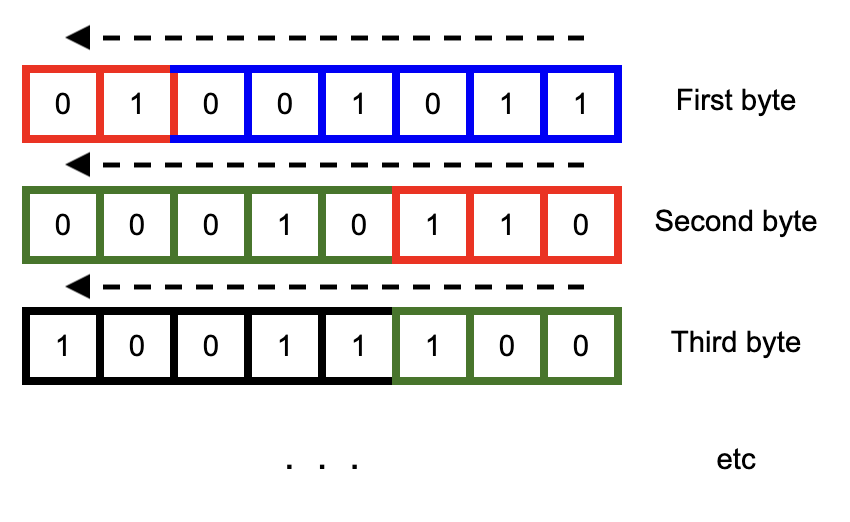
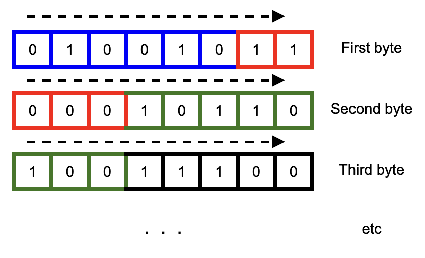

# bitjs.io

This package includes stream objects for reading and writing binary data at the bit and byte level:
BitStream, ByteStream.

## BitStream

A bit stream is a way to read a variable number of bits from a series of bytes. This useful for
parsing certain protocols (for example pkzip or rar algorithm). Note that the order of reading
bits can go from least-to-most significant bit, or the reverse.

### Least-to-Most Direction



```javascript
const bstream = new BitStream(ab, false /* mtl */);
bstream.readBits(6); // (blue)  0b001011 = 11
bstream.readBits(5); // (red)   0b11001 = 25
bstream.readBits(8); // (green) 0b10000010 = 130
```

### Most-to-Least Direction



```javascript
const bstream = new BitStream(ab, true /* mtl */);
bstream.readBits(6); // (blue)  0b010010 = 18
bstream.readBits(5); // (red)   0b11000 = 24
bstream.readBits(8); // (green) 0b10110100 = 180
```
